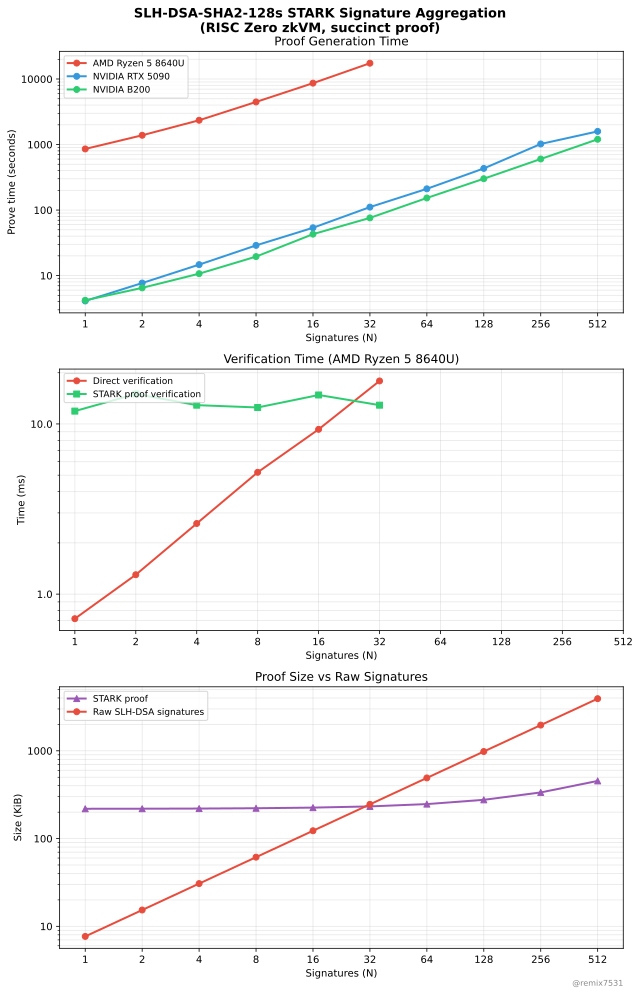

# Benchmarking SLH-DSA Signature Aggregation with STARK

Proof-of-concept and benchmarking of STARK-based Signature Aggregation of [SLH-DSA-SHA2-128s](https://csrc.nist.gov/pubs/fips/205/final) (SPHINCS+, SHA-256 variant) post-quantum signatures using [RISC Zero](https://risczero.com)'s zkVM. RISC Zero was chosen for ease of prototyping and its SHA-256 compression function accelerator. A production system would use a dedicated STARK circuit rather than a general-purpose zkVM, but the measurements give a rough approximation of proving cost.

The goal is to measure the feasibility of aggregating N SLH-DSA signatures into a single constant-size STARK proof.

## Motivation

Post-quantum signature schemes for Bitcoin are actively discussed. SLH-DSA (SPHINCS+) is a candidate because it is NIST-standardized (FIPS 205), stateless, and relies only on hash function security. Unlike stateful hash-based schemes, SLH-DSA requires no changes to wallet or hardware signer workflows and has no risk of key reuse from lost state.

The downside: SLH-DSA signatures are large (7,856 bytes for SHA2-128s), which would significantly reduce Bitcoin's transaction throughput if included on-chain. STARK signature aggregation addresses this by replacing all per-transaction signatures with a single constant-size proof, which could increase throughput by roughly 10x compared to today.

STARKs are a natural pairing with SLH-DSA: both are post-quantum secure and rely solely on hash function security, with no trusted setup or additional cryptographic assumptions.

STARK proving for SLH-DSA is expensive because SHA-256 is not circuit-friendly and a single SLH-DSA verification requires many compression calls. Other ecosystems (e.g. Ethereum) use algebraic hash functions like Poseidon that are optimized for arithmetic circuits. This benchmark explores whether SHA-256 based proving is manageable with modern hardware.

## Project structure

| Directory | Description |
|-------|-------------|
| `sha2-risc0` | SHA-256 implementation optimized for RISC Zero's zkVM |
| `slh-dsa` | SLH-DSA-SHA2-128s (FIPS 205) verification and signing |
| `cli` | CLI tools for each step of the pipeline |
| `methods/guest` | Signature verification program that runs inside the zkVM |
| `demo` | Benchmark script and results |

## Pipeline

Generate keypairs:
```bash
./target/release/keygen -n 4 -o secrets.json -p pubkeys.json
```

Sign messages:
```bash
./target/release/sign -k secrets.json -m messages.json -o sigs.json
```

Aggregate signatures into a STARK proof:
```bash
./target/release/prove -k pubkeys.json -m messages.json -s sigs.json -o proof.bin
```

Verify the STARK proof:
```bash
./target/release/verify -p proof.bin -k pubkeys.json -m messages.json
```

Signatures can also be verified directly without a proof:
```bash
./target/release/verify -s sigs.json -k pubkeys.json -m messages.json
```

## Building

Requires [Nix](https://nixos.org/download/) with flakes enabled. For Ubuntu GPU machines without Nix, see [INSTALL-UBUNTU-GPU.md](INSTALL-UBUNTU-GPU.md).

```bash
nix develop
```

Build:
```bash
cargo build --release
```

For GPU-accelerated proving:
```bash
cargo build --release --features cuda
```

## Running benchmarks

Full pipeline for N signatures (keygen, sign, verify, prove, verify proof):
```bash
bash demo/run.sh 8
```

Dev mode (no real proof, for testing the pipeline):
```bash
RISC0_DEV_MODE=1 bash demo/run.sh 8
```

## Results

Proving time scales linearly with N. Average per-signature proving time:

- **AMD Ryzen 5 8640U** (CPU): ~544 s/sig (~9 min, at N=32)
- **NVIDIA RTX 5090**: ~3.1 s/sig (at N=512)
- **NVIDIA B200**: ~2.4 s/sig (at N=512)

The proof is a constant ~219–454 KiB regardless of N, and STARK proof verification takes a constant ~12–15 ms.

The B200 is only ~1.3× faster than the RTX 5090 despite being a significantly more expensive GPU. Profiling shows the workload is compute-bound rather than memory-bound, so the B200's larger memory (bandwidth) provides little advantage here.



## License

This project is licensed under the [GNU General Public License v3.0](https://www.gnu.org/licenses/gpl-3.0.html).
